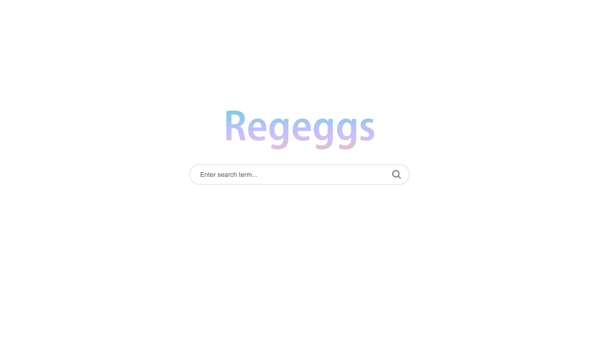
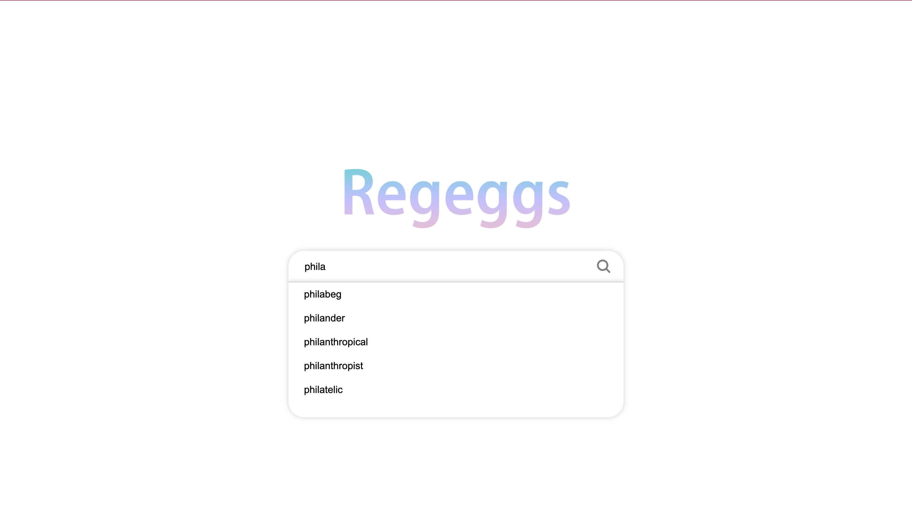
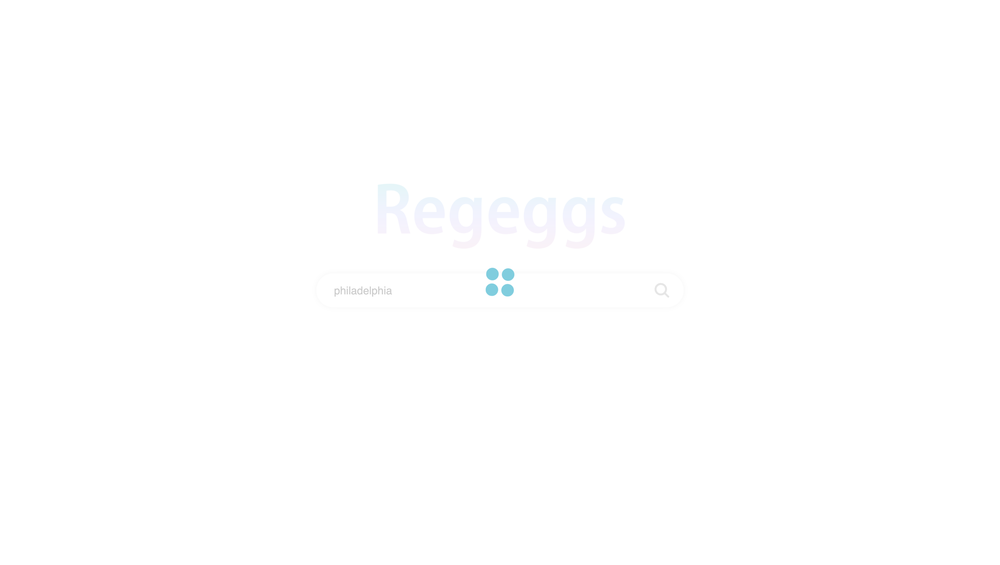

<p align="center">

</p>

# Introduction of Regeggs Search Engine
Welcome to the Regeggs Search Engine repository! This project harnesses the power of a Spark-like Java web server and a tailored version of Apache Spark, which we've named Flame. Our search engine is built on a robust architecture that utilizes Flame for crawling and data processing, paired with a KVS Coordinator/Workers setup for orchestration. This combination allows us to effectively manage the crawling, indexing, and analysis of over 500,000 web pages.

- Distributed Flame Engine: Modified Apache Spark that supports RDD and PairRDD, optimizing our data handling and computational efficiency.
- Scalable Crawling: Utilizes a powerful yet polite crawling mechanism with a comprehensive list of seed URLs, ensuring a broad range of relevant search results.
- Advanced Analytics: Implements algorithms for PageRank and TFIDF calculations, providing a strong foundation for relevant and accurate search results.
- User-Friendly Interface: Hosts a search server with a beautifully designed user interface that makes navigation and usage straightforward for end-users.

# Approved third-party components used:
- [Apache OpenNLP](https://opennlp.apache.org/) (SentenceDetector) for analyzing page content and extracting meaningful information as snippets in search results
- [466k words.txt](https://github.com/dwyl/english-words/tree/master) for autocompleting English search terms while user typing in search bar

# How to run the code locally:
Clone the main repository

For testing purpose: we recommand keeping the amount of pages crawled small, please sign-in with SEAS account first to download the files needed for the 20k pages: 
- [Download Pagerank Table](https://drive.google.com/file/d/12irFzDdmYJ9t1ULqrHjHZStoNkcC_TwM/view?usp=drive_link)
- [Download TFIDF Table](https://drive.google.com/file/d/1GjLlIhaIiYorzPvjO1kgAZVdx1Z41pQV/view?usp=drive_link)
- [Download Crawl Table](https://drive.google.com/file/d/16AuMBUi9zhVtRCQf1oZliALb2amJFetf/view?usp=drive_link)

After download please unzip the three tables under worker1/ and make sure that the three table directories are named as: **"pt-crawl"**, **"pt-pageranks"** and **"pt-TFIDF"**, this is to ensure consistency with the default file path we used. 

In the root directory of this project, run script.sh, this will compile and run required classes together (you may specify any desired number of flame/kvs workers in script.sh):
```
bash script.sh
```

Then, run src/cis5550/search/SearchServer.java in IDE or use the command below, please ensure that port 80 is available:
```
java -cp "classes:lib/*" cis5550.search.SearchServer
```

Now open the following URL in your browser, to try out Regeggs Search Engine:
```
localhost:80
```

# How Regeggs looks like in browser
- Regeggs homepage:

  
  


- Search with autocomplete:

  

- Loading component while fetching results:

  


- Display of search results:
  
  


- Hover-over page preview:
  
  


